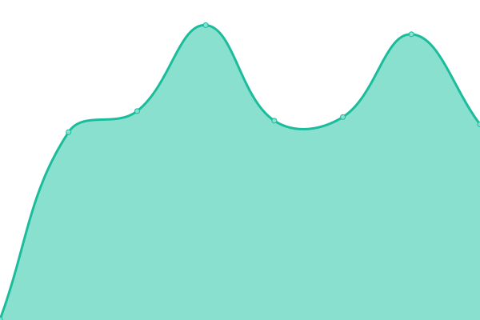

# [📈 Live Status](https://Cysime.github.io/GlaceonStatus): <!--live status--> **🟧 Partial outage**

This repository contains the open-source uptime monitor and status page for [Cysime Moflu](https://cysi.me), powered by [Upptime](https://github.com/upptime/upptime).

With [Upptime](https://upptime.js.org), you can get your own unlimited and free uptime monitor and status page, powered entirely by a GitHub repository. We use [Issues](https://github.com/Cysime/GlaceonStatus/issues) as incident reports, [Actions](https://github.com/Cysime/GlaceonStatus/actions) as uptime monitors, and [Pages](https://Cysime.github.io/GlaceonStatus) for the status page.

<!--start: status pages-->
<!-- This summary is generated by Upptime (https://github.com/upptime/upptime) -->
<!-- Do not edit this manually, your changes will be overwritten -->
<!-- prettier-ignore -->
| URL | Status | History | Response Time | Uptime |
| --- | ------ | ------- | ------------- | ------ |
|  [Media Center](https://media.glaceon.net) | 🟩 Up | [media-center.yml](https://github.com/Cysime/GlaceonStatus/commits/HEAD/history/media-center.yml) | 

 493ms
     
 | 

<a href="https://status.glaceon.net/history/media-center">100.00%</a>
    

|  Seedbox Library | 🟩 Up | [seedbox-library.yml](https://github.com/Cysime/GlaceonStatus/commits/HEAD/history/seedbox-library.yml) | 

 382ms
     
 | 

<a href="https://status.glaceon.net/history/seedbox-library">100.00%</a>
    

|  Node - Apple Jack | 🟩 Up | [node-apple-jack.yml](https://github.com/Cysime/GlaceonStatus/commits/HEAD/history/node-apple-jack.yml) | 

 311ms
     
 | 

<a href="https://status.glaceon.net/history/node-apple-jack">100.00%</a>
    

|  Node - Big Mcintosh | 🟥 Down | [node-big-mcintosh.yml](https://github.com/Cysime/GlaceonStatus/commits/HEAD/history/node-big-mcintosh.yml) | 

 0ms
     
 | 

<a href="https://status.glaceon.net/history/node-big-mcintosh">0.00%</a>
    

|  Node - Discord | 🟥 Down | [node-discord.yml](https://github.com/Cysime/GlaceonStatus/commits/HEAD/history/node-discord.yml) | 

 0ms
     
 | 

<a href="https://status.glaceon.net/history/node-discord">0.00%</a>
    

|  Node - Fluttershy | 🟩 Up | [node-fluttershy.yml](https://github.com/Cysime/GlaceonStatus/commits/HEAD/history/node-fluttershy.yml) | 

 506ms
     
 | 

<a href="https://status.glaceon.net/history/node-fluttershy">100.00%</a>
    

|  Node - Rarity | 🟥 Down | [node-rarity.yml](https://github.com/Cysime/GlaceonStatus/commits/HEAD/history/node-rarity.yml) | 

 641ms
     
 | 

<a href="https://status.glaceon.net/history/node-rarity">100.00%</a>
    

|  Node - Starlight Glimmer | 🟩 Up | [node-starlight-glimmer.yml](https://github.com/Cysime/GlaceonStatus/commits/HEAD/history/node-starlight-glimmer.yml) | 

 531ms
     
 | 

<a href="https://status.glaceon.net/history/node-starlight-glimmer">100.00%</a>
    

<!--end: status pages-->

[**Visit our status website →**](https://Cysime.github.io/GlaceonStatus)

## 📄 License

- Powered by: [Upptime](https://github.com/upptime/upptime)
- Code: [MIT](./LICENSE) © [Cysime Moflu](https://cysi.me)
- Data in the `./history` directory: [Open Database License](https://opendatacommons.org/licenses/odbl/1-0/)
